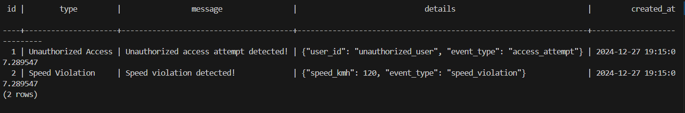

## Run 
```
uvicorn app:app --reload
```
## Check Server Curl 
```
curl http://localhost:8000/
```
```
curl -X POST http://localhost:8000/start-consumer
```

## Curl command - create 
# Step 1
```
curl -X POST "http://127.0.0.1:8000/start-consumer"
```
# Step 2
```
curl -X POST "http://127.0.0.1:8000/start-consumer" -H "Content-Type: application/json" -d '{"device_id":"AA:BB:CC:DD:EE:FF","timestamp":"2024-12-18T14:00:00Z","event_type":"access_attempt","user_id":"unauthorized_user"}'
```
# Step 3 
* Check if the Alert is Saved to PostgreSQL:
```
docker exec -it configs-postgres-1 psql -U admin -d iot_events
```
# Step 4
```
SELECT * FROM alerts;

```
# load new from pg_hba.conf.sample
```
SELECT pg_reload_conf();

```
## The data should be displayed as shown in the image.



## Check alerts in curl
```
curl "http://localhost:8000/alerts?event_type=Unauthorized%20Access&limit=5"
```
# If you Have Error 
https://docs.google.com/document/d/16PatyEYmDUyZmu0ZGR-velZ343uX4Kclplq2ROpgboQ/edit?usp=sharing